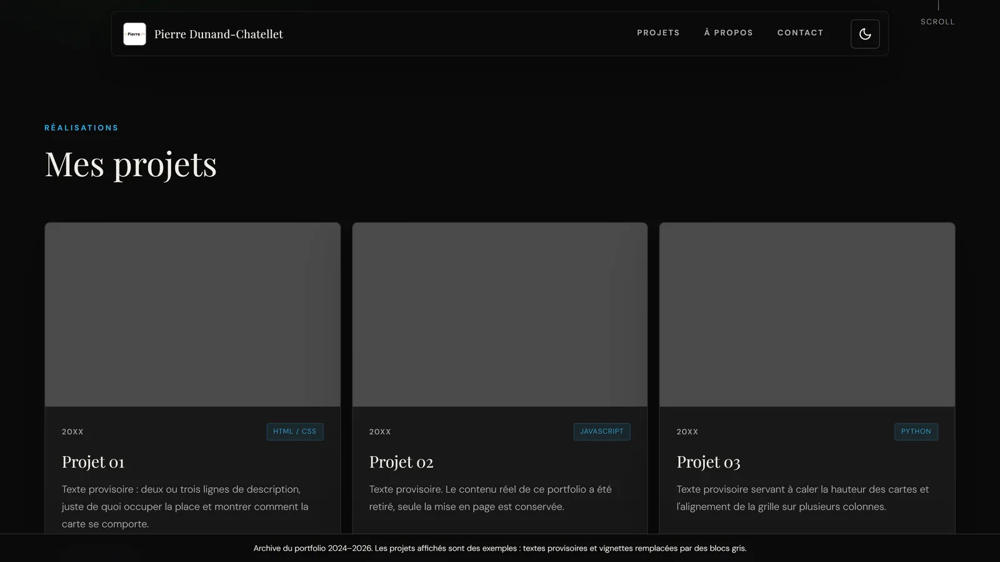

# Portfolio v1

Première version de mon portfolio, en ligne de 2024 à septembre 2026. Elle a
été remplacée par une refonte, mais je la garde comme archive : c'est la
maquette qui m'a servi à apprendre la mise en page en CSS.

**En ligne :** https://dunandchatellet.fr/portfolio-v1/

## Contenu d'exemple

Les projets affichés ne sont **pas** de vrais projets. Les titres, les textes
et les vignettes ont été remplacés par des exemples (« Projet 01 », textes
provisoires, blocs gris) afin de ne montrer que la mise en page. Le formulaire
de contact est volontairement inerte.

Mes vrais projets sont sur mon portfolio actuel :
https://dunandchatellet.fr/

## Ce qu'il y a dedans

| Fichier | Rôle |
| --- | --- |
| `index.html` | Accueil : hero, grille de projets, à propos, contact |
| `projets.html` | Liste complète, rangée par catégorie |
| `styles.css` | Toute la mise en forme, thèmes compris |
| `script.js` | Menu, thème, compteur d'années, transitions de page |
| `image/` | Le logo |

Pas de dépendance, pas d'outil de build, pas de framework : trois fichiers et
deux polices Google Fonts. Il suffit d'ouvrir `index.html` dans un navigateur.

## Ce que j'ai appris en le faisant

- **Thème clair/sombre en variables CSS.** Le sombre est l'état de base, le
  clair vient le surcharger via `:root[data-theme="light"]`. Comme toutes les
  couleurs passent par des variables, un thème ne redéfinit que les variables
  et jamais les règles.
- **La View Transitions API.** Les pages ne sont pas rechargées : le contenu
  est récupéré en `fetch` et remplacé, ce qui laisse le navigateur animer le
  passage. Piège rencontré : le `<body>` étant remplacé, tous les écouteurs
  posés dessus disparaissent et doivent être rebranchés — mais celui de la
  navigation est posé sur `document`, et le rebrancher doublerait le nombre
  d'écouteurs à chaque page.
- **Une grille responsive** en `repeat(auto-fill, minmax(320px, 1fr))`, qui
  change de nombre de colonnes toute seule sans point de rupture.
- **Un compteur qui se met à jour tout seul** : le nombre d'années de code se
  calcule à partir d'une date de départ posée dans le HTML, et ne s'incrémente
  qu'une fois la date anniversaire passée.

## Licence

Code libre de réutilisation. Le contenu et le logo restent à moi.
